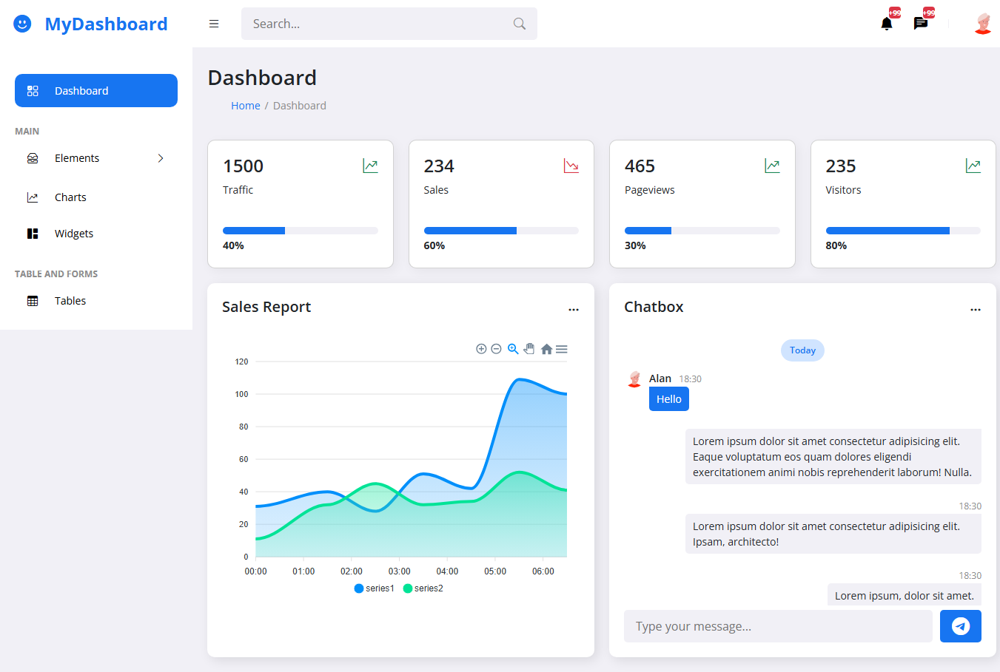

# 🛍️ Store Dashboard

A responsive and interactive dashboard for managing and visualizing **store sales data**, customers, and product performance.


## 🚀 Features
- 📊 Sales overview with charts and KPIs  
- 👥 Customer management insights  
- 🛒 Product performance tracking  
- 📈 Interactive and responsive design  


## 🖼️ Screenshot
Here is a preview of the dashboard:




## 🛠️ Tech Stack
- HTML, CSS, JavaScript  
- Bootstrap
- APEXCHARTS.JS


## 📂 Project Structure
```
store-dashboard/
 ├── avatar.svg
 ├── bootstrap.min.css
 ├── index.html
 ├── script.js
 ├── style.css
 └── screenshots/
     └── screen.png
```

## 📦 Installation & Usage
1. Clone the repository:
   
```bash
   git clone  https://github.com/dvlprpy/Dashboard1.git
```
